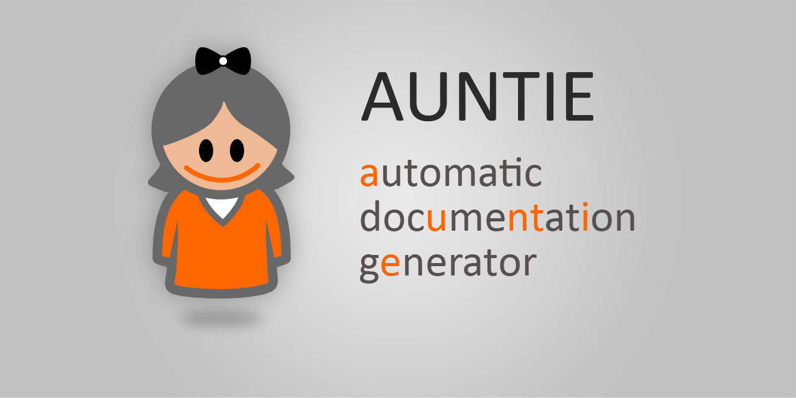

# AUNTIE
## Automatic docUmeNTatIon gEnerator

This application is a simple static website generator, best suited for producing
technical documentation. You provide content as *.txt files and presentation via
a custom HTML template.

The text files need to be authored using the [CommonMark](https://commonmark.org)
syntax (a standardized version of Markdown).

Upon export, the program converts MarkDown to HTML and builds a navigation tree
out of the original files' location and numbering scheme (e.g., *1.1. My File.txt*
is a child of *1. My Other File.txt*; numbering can also be applied to first header
in each file).

The final result is a fully navigable and standalone HTML compilation that you can
upload to your web server.

### Usage:
````
> auntie <source> <target> [<options file>]
````

Where:
- `<source>`: Path to a local file or folder to supply the text for converting. For
the path, use an application-relative link, or an absolute file path. By default,
all `*.txt` files found are converted and included in the resulting compilation,
but this behavior can be changed using the `<options>` file (see the
`sourceFileTypes` setting). As for marking a file for exclusion, you can type
`$$nocompile` as the first thing in the respective file;

- `<target>`: Path to a local file or folder to deposit the formatted document(s)
in. The two paths cannot be identical; moreover, if the `<source>` is a folder, the
`<target>` must be a folder as well. Other than that, the same path rules apply as
for `<source>`;

- `<options file>`: Optional. Path to a local file in JSON format to load
additional configuration from. See file: [src/samples/sample-options.json](https://github.com/ciacob/auntie/blob/master/src/samples/sample-options.json) for more
details (the file has its own documentation, because AUNTIE happily **accepts
C-style comments inside the `<options file>`**. See also file:
[src/samples/sample-template.html](https://github.com/ciacob/auntie/blob/master/src/samples/sample-template.html), which you can use as a starting point for your
own HTML templates.
